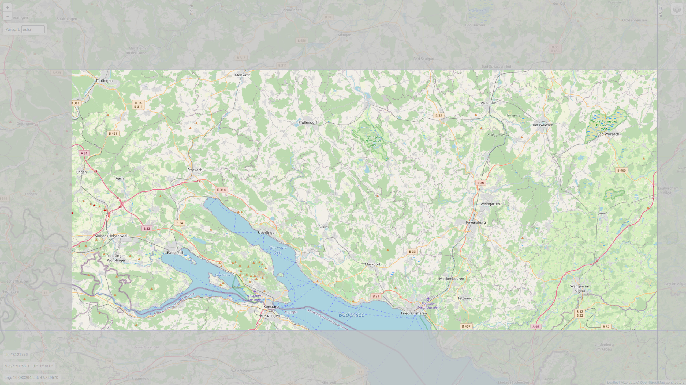

# Friedrichshafen-custom-scenery
FlightGear custom scenery for the Bodensee region, Germany

### This package contains:

*  Friedrichshafen (EDNY)
	* included new airport
	* custom main buildings
	* secondary buildings (todo)
	* ILS both runways
	* FMS procedures
* Pfullendorf (EDTP)
	* included new airport
	* custom buildings
* Konstanz (EDTZ)
	* upgraded airport layout
	* custom buildings
* Neuhausen ob Eck (EDSN)
	* upgraded airport layout
	* custom buildings (todo)
* Radolfzell-Stahringen (EDSR)
	* upgraded airport layout
	* custom buildings (todo)
* Heiligenberg (XEDCQ)
	* upgraded airport layout
	* custom buildings (todo)
* Markdorf (XEDD7)
	* upgraded airport layout
* Sauldorf-Boll UL (XED003Q)
	* upgraded airport layout
* Wangen-Kisslegg (XEDDJ)
	* upgraded airport layout
* Waldsee-Reute (XED003X)
	* upgraded airport layout
* Hilzingen (XEDC0)
	* upgraded airport layout
* [H] Klinikum Friedrichshafen (XED002O)
	* upgraded airport layout
        

        
### Requirements:

* latest set of shared objects:
	http://flightgear.sourceforge.net/scenery/Models/
        
### Data sources:

* SRTM-3 global elevation data:
	http://viewfinderpanoramas.org/Coverage%20map%20viewfinderpanoramas_org3.htm
* CORINE landcover data:
	https://land.copernicus.eu/pan-european/corine-land-cover/clc2018?tab=mapview
* OSM landmass data:
	https://osmdata.openstreetmap.de/data/land-polygons.html
* x-Plane detailed airports:
	https://gateway.x-plane.com
* FlightGear terrasync objects:
	https://scenery.flightgear.org/
* FMS-procedures hosted by pinto:
	https://github.com/l0k1/fg-navaiddata
* osm2city:
	https://gitlab.com/osm2city
* osm raw data:
	https://download.geofabrik.de/

### Special thanks to:

* D-ECHO
* d-laser (https://github.com/mherweg/d-laser-fgtools)
    
    
Sven Seipp, Feb 2022
